# 在 Amazon SageMaker 上进行 ChatGLM finetune

本实验将介绍如何在 [Amazon SageMaker](https://aws.amazon.com/cn/sagemaker/) 上进行 [ChatGLM](https://github.com/THUDM/ChatGLM-6B) 模型的微调，内容包括：

1. 创建 SageMaker Notebook Instance.
2. 使用两种方式实现 ChatGLM 模型的微调:

- 通过 SageMaker Notebook

- 通过 SageMaker Training Job

## 0. 前置准备工作

1、首先注册 [AWS 海外账号](https://aws.amazon.com/cn/)，您需要有一张信用卡即可注册。

2、新账号默认有资源使用的限制，我们称为 service quota，您可以通过提工单的方式申请 GPU 资源，操作方式见该[手册](./service%20quota%20for%20chatglm%20.pdf)。

## 1. 准备实验环境

#### 1.1 准备 Notebook 实例

进入控制台, 搜索sagemaker并选择.

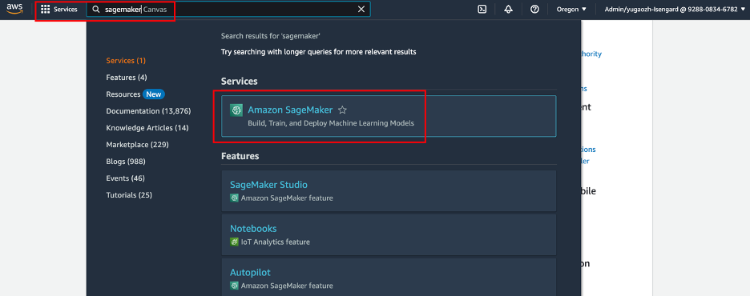

选择 “Notebook instances”.

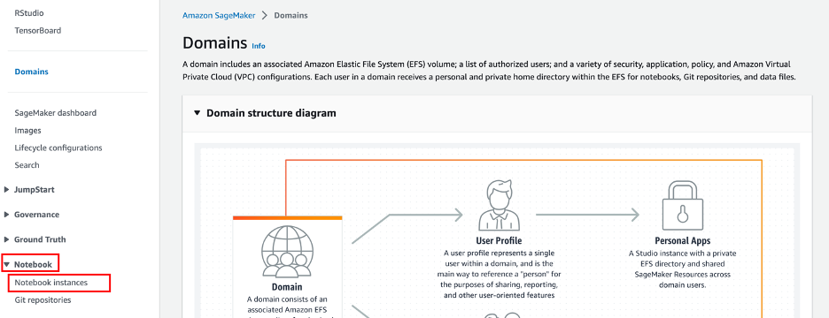

创建 Notebook Instance.

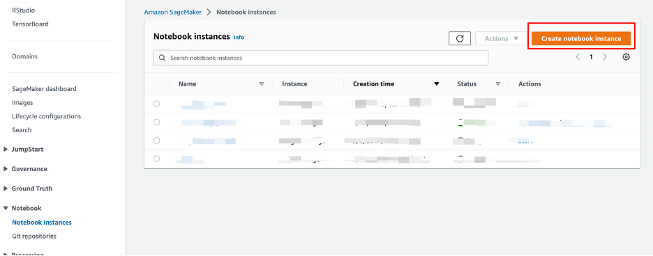

#### 1.2 配置实例

##### 配置名称和机型

- 名称：“aws-sagemaker-llm-chatglm-finetune“（自定义）

- 机型：“ml.p3.2xlarge”

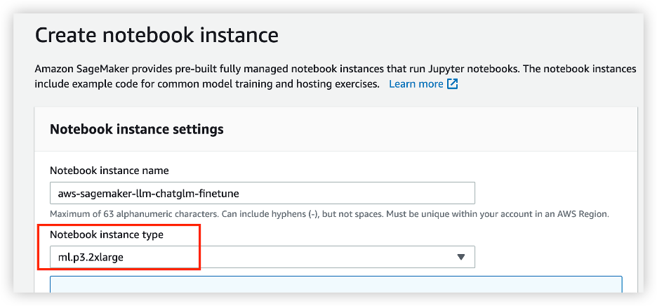

##### 配置存储

实验中涉及原始模型、训练数据、微调模型，需要较大硬盘，此处设置为500GB.

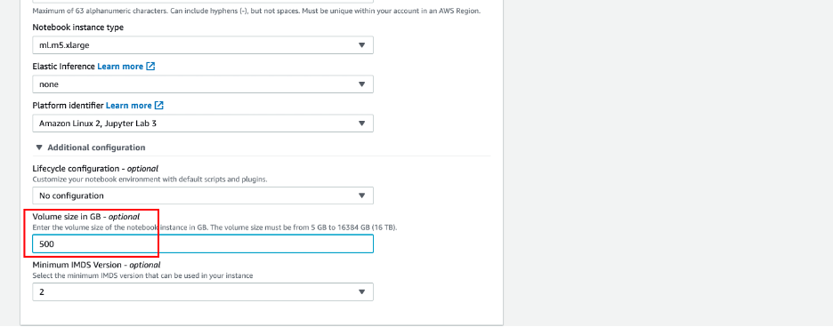

##### 设置权限

实验中必须设置必要权限,才能确保实验顺利完成.

选择“Create a new role”.

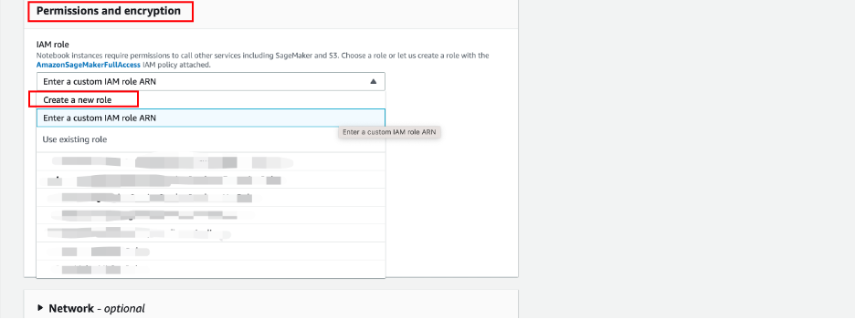

创建角色.

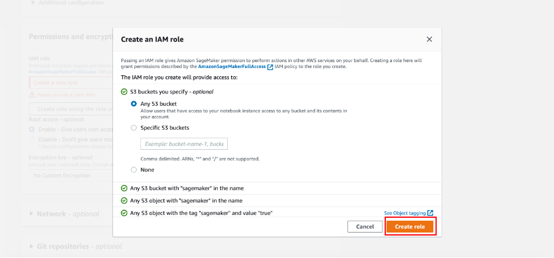

确认角色创建成功.

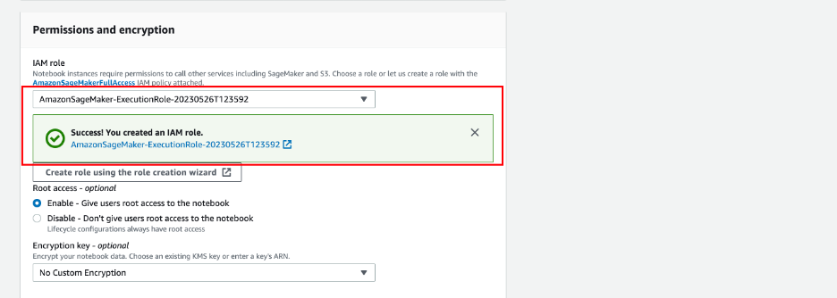

#### 1.3 启动实例

其余配置保持默认，启动notebook instance

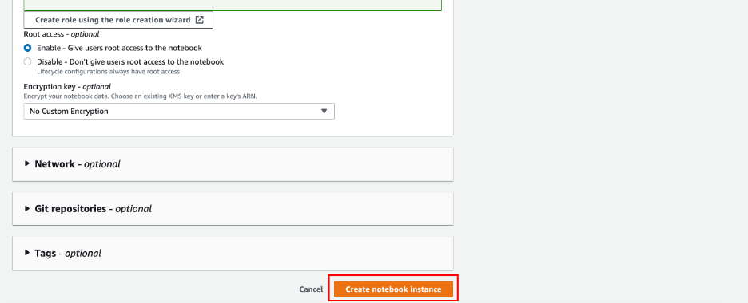

#### 1.4 查看实例

实例创建需要几分钟的时间,初始时处于“Pending”状态.

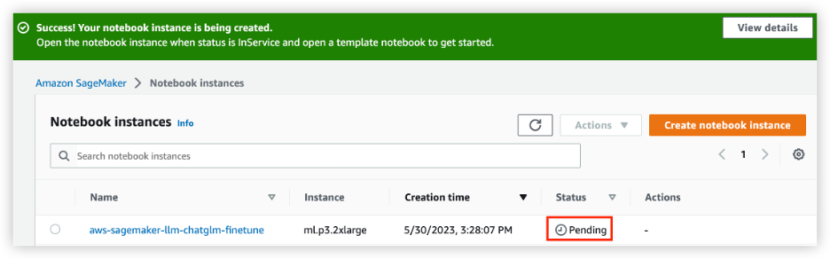

请确保实例处于“InService”状态后,点击“Open JupyterLab”,打开JupyterLab.

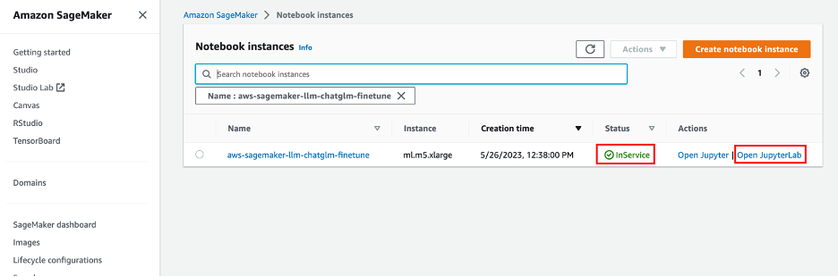

页面显示如下:

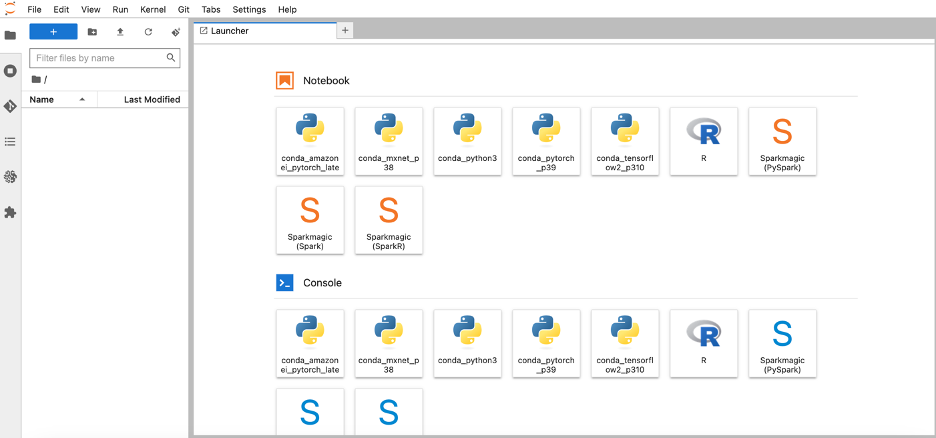

#### 1.5 下载实验代码

打开Terminal

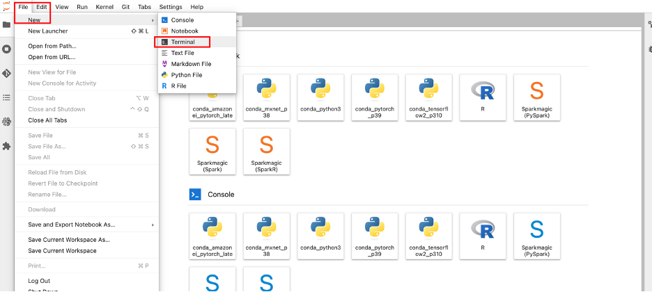

下载代码:

```shell
cd SageMaker/
```

```shell
git clone https://github.com/GlockGao/aws-sagemaker-llm.git
```


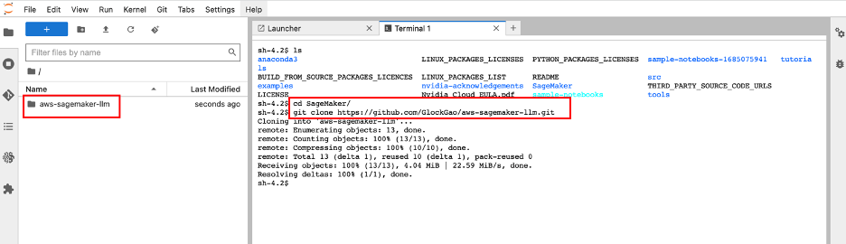

## 2. Fine tune ChatGLM (基于 Ptuning)

实验使用两种方式实现 ChatGLM 模型的微调: （二选一）

(1) SageMaker Notebook, 使用Notebook Instance资源(例如ml.p3.2xlarege, ml.g4dn.2xlarge、等)进行模型的训练，SageMaker Notebook 提供托管的预置好环境的 Jupyter Notebook，对应 [chatglm-sagemaker-finetune-ptuning-notebook.ipynb](./ChatGLM/chatglm-sagemaker-finetune-ptuning-notebook.ipynb)

(2) SageMaker Training Job, 提交模型训练任务到SageMaker后台对应的分布式集群,可利用SageMaker分布式框架实现多机多卡的模型训练，对应 [chatglm-sagemaker-finetune-ptuning.ipynb](./ChatGLM/chatglm-sagemaker-finetune-ptuning.ipynb)

## 3. 部署原始ChatGLM模型 (可选）

SageMaker 提供对模型部署的支持，SageMaker将自动为您封装好 API 调用接口，并支持自动扩展，监控和日志，认证和鉴权等，您可以参考该示例 [chatglm-sagemaker-endpoint-byos.ipynb](./ChatGLM/chatglm-sagemaker-endpoint-byos.ipynb)。
